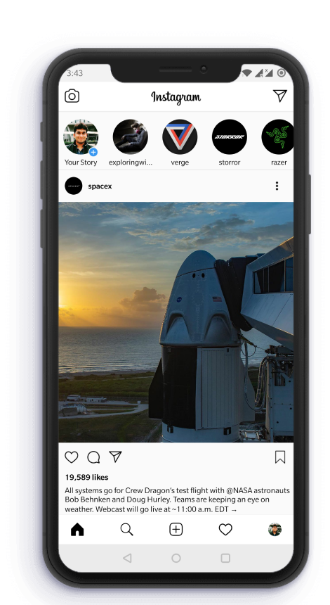

# Insta47

Insta47 created with Kotlin and Firebase. 

## Developed by
Cody47

Show some ❤️ and ⭐️ the repo to support the project.

The idea behind this project is to design the clone of the Instagram app and the tools &amp; techniques behind this application will be kotlin.

## Commit

### Requirements
Android Studio 3.0 or newer installed.

## Features
- Feed 
    - Post Detail
    - Like 
    - Reels
- Post 
    - Photo Upload
    - Edit 
    - Delete 
    - Download
- Search
    - Search User
- Profile 
    - Edit Profile
    - Follow / Unfollow 
    - Log Out
    - Mass Follow/Unfollow
- Splash
    - Email Login
    - Sign Up

## Upcoming Features
- Like
    - Like Histories
    - Anonymous Live 
    - Who Unfollowed You
- VOD
    - Video Service 

## Libraries Used
- [Android Architecture Components](https://developer.android.com/topic/libraries/architecture)
- [Android Support Library](https://developer.android.com/topic/libraries/support-library/index.html)
- [Constraint layout](https://developer.android.com/training/constraint-layout/index.html)
- [Glide](https://github.com/bumptech/glide)
- [Kotlin](https://github.com/JetBrains/kotlin)
- [Dagger](https://google.github.io/dagger/)
- [RxKotlin](https://github.com/ReactiveX/RxKotlin)
- [RxAndroid](https://github.com/ReactiveX/RxAndroid)
- [RxFirebase](https://github.com/kunny/RxFirebase)
- [Firebase](https://github.com/firebase/)
- [ThreeTenABP](https://github.com/JakeWharton/ThreeTenABP)

### License
This project is licensed under the [MIT License](LICENSE)
